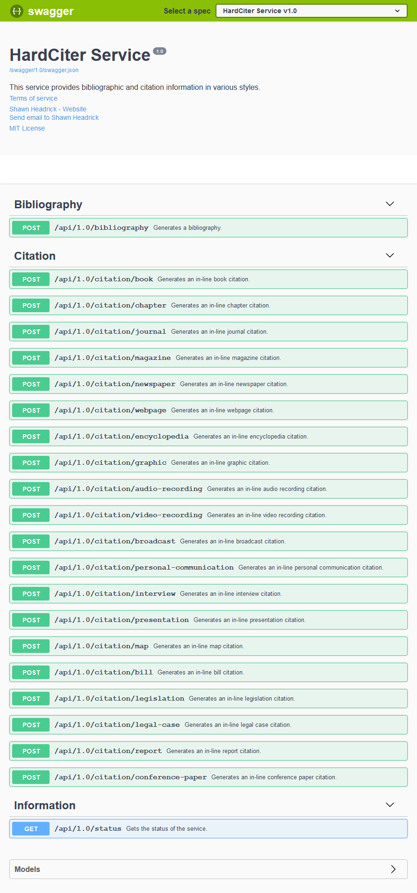

# HardCiter Service

[https://hard-citer.herokuapp.com](https://hard-citer.herokuapp.com)

This service provides bibliographic and citation information in various styles.

While supporting an extensible architecture, the initial implementation uses CiteProc / CSL for processing:

* [CiteProc Wikipedia Entry](https://en.wikipedia.org/wiki/CiteProc)
* [CiteProc Manual](https://citeproc-js.readthedocs.io)
* [CSL Specification](https://docs.citationstyles.org/en/1.0.1/specification.html)

## Requirements

This package is built on the following technologies:

* [.NET Core](https://docs.microsoft.com/en-us/dotnet/core/)
* [Node.js](https://nodejs.org/en/)

Given that .NET Core and Node.js are cross-platform, it should run successfully on Windows, MacOS and Linux.

## Screenshot

## Build Tasks

The following tasks are available from the root (`./`) directory:

* `dotnet clean HardCiter.sln /p:Configuration="{Debug|Release}"` - Cleans the solution.
* `dotnet build HardCiter.sln /p:Configuration="{Debug|Release}"` - Compiles the solution.
* `dotnet test HardCiter.sln /p:Configuration="{Debug|Release}" /p:EnvironmentName="{Local|DEV|QA|Stage|Production}" /p:CollectCoverage="True" /p:CoverletOutput="./TestCoverage/" /p:CoverletOutputFormat="{JSON|LCOV|OpenCover|Cobertura}"` - Runs all unit tests in the solution and generates a code coverage report.
* `dotnet publish HardCiter.sln /p:Configuration="{Debug|Release}" /p:EnvironmentName="{Local|DEV|QA|Stage|Production}"` - Creates a deployment package suitable for hosting.

The following tasks are available from the service project (`./HardCiter.Service`) directory:

* `dotnet run --Environment "{Local|DEV|QA|Stage|Production}"` - Starts Kestrel on the port specified in the `launchSettings.json` file (by default [https://localhost:6800](https://localhost:6800)).

## Client Generation Tasks

While there are multiple ways to consume a REST-ful service, a useful tool to consider when configuring a client is [AutoRest](https://github.com/Azure/autorest). It is a Node.js package that supports the following target languages:

* `autorest --input-file="swagger.json" --output-folder="./code/" --namespace="HardCiter" --csharp` - Generate C# client files.
* `autorest --input-file="swagger.json" --output-folder="./code/" --namespace="HardCiter" --nodejs` - Generate Node.js / JavaScript client files.
* `autorest --input-file="swagger.json" --output-folder="./code/" --namespace="HardCiter" --python` - Generate Python client files.
* `autorest --input-file="swagger.json" --output-folder="./code/" --namespace="HardCiter" --java` - Generate Java client files.
* `autorest --input-file="swagger.json" --output-folder="./code/" --namespace="HardCiter" --ruby` - Generate Ruby client files.
* `autorest --input-file="swagger.json" --output-folder="./code/" --namespace="HardCiter" --go` - Generate Go client files.
* `autorest --input-file="swagger.json" --output-folder="./code/" --namespace="HardCiter" --typescript` - Generate TypeScript client files.

## Acknowledgements

Many thanks to Nancy for lending me her librarian skills in sanity checking the output of this service.

## TODO List

* [Update CSL Processor](https://github.com/Juris-M/citeproc-js/releases)
